# Docker Course 🐋


<br>
img src: https://miro.medium.com/max/336/1*glD7bNJG3SlO0_xNmSGPcQ.png

I'm learning Docker from this  [YouTube](https://www.youtube.com/watch?v=9zUHg7xjIqQ&t=2694s)
<br>

---

### 1: Pull Image & View

ลอง pull อะไรก็ได้ใน hub.docker
```docker pull node```

```docker images```

```docker image ls```

### 2: Run Image

```docker run [image]```
จะเห็นว่ามันดับไป (ถ้าเป็น Ubuntu แต่ถ้าเป็น App console.log เฉย ๆ มันก็จะแสดงผลให้

```docker run -it [image]```
เข้า Interactive mode เช่น อาจจะเข้า bash ให้

```docker run -d [image]```
รันแบบ detached head

```docker run -d --name [ชื่อที่จะตั้งให้] [image]```
รันแบบ detached head + ตั้งชื่อ (ไม่ต้องให้มันสุ่มให้อีกต่อไป)


### 3: Basic commands

```docker ps```
ดู running container

```docker ps -a```
ดู container ทั้งรันอยู่และในอดีต

```docker restart [NAMES]```
เพื่อเปิด (เขียวขึ้นที่ Docker แต่ยังไม่เข้า bash

```docker exec -it [NAMES] bash```
จะเข้า bash ให้จ้า

```docker rm [NAMES] -f```
ลบ container

```docker image remove [IMAGE ID]```
ลบ Image

```docker restart node-app```
Restart

***Map port[portเรา:portdocker]***

จะได้เปิดใน browser ได้
```
docker run -p 3000:3000 -d --name node-app node-app-image
```

Bind mount / Annonymous Volume / nodemon
---


### Bind mounts 
Sync container เรา กับ docker ได้ 
ใช้ dockerignore ช่วยได้เหมือน gitignore

1. Absolute - ตั้ง path แบบตรง ๆ ซื่อ ๆ
```
docker run -v C:\Users\siraw\node-docker:/app -p 3000:3000 -d --name node-app node-app-image  
```

2. Relative

    1. Powershell
    ```
    docker run -v ${pwd}:/app -p 3000:3000 -d --name node-app node-app-image
    ```
    2. CMD

    ```
    docker run -v %cd%:/app -p 3000:3000 -d --name node-app node-app-image
    ```
    3. MAC
    ```
    docker run -v $(pwd):/app -p 3000:3000 -d --name node-app node-app-image
    ```

### ลง nodemon
จริง ๆ ตอนนี้มัน sync แล้ว แค่ไม่มี nodemon ไว้ monitor ให้

- ลง nodemon
เป็น dev dependency ไม่ต้องการให้ run ตอน production
```npm install nodemon --save-dev```

- เพิ่ม script ใน json
  ```json
  "start": "node index.js",
  "dev": "nodemon -L index.js
  ```

- ตอนจะรันก็

  ปกติเรา npm start น่าจะ implicit ```npm run start```
  ตอนนี้ก็ ```npm run dev``` แทน 👏


**หน้าตา Dockerfile ตอนนี้**
```Dockerfile
FROM node:15
WORKDIR /app
COPY package.json .
RUN npm install
COPY . ./
EXPOSE 3000
CMD ["npm", "run", "dev"]
```

```Dockerfile
FROM node:15
WORKDIR /app
COPY package.json .
# At build time
RUN npm install
# Split for optimization
COPY . ./
# This line doesn't actually open up port 3000!
# It's for documentation purpose 
EXPOSE 3000
# At run time
# CMD ["node", "index.js"]
CMD ["npm", "run", "dev"]
```


ถ้าลบ node_modules ใน local machine ไป
ตอน COPY . ./ ก็จะ overwrite folder ใน container ไปด้วย ทำให้พังจ้า

ดู log
```docker log [NAMES]```
วิธีแก้ไข ให้เพิ่ม Anonymouse Volume


### Anonymous Volume
ห้ามไม่ให้ overwrite /app/node_modules
แต่แปลว่า ตั้งแต่แรกเราก็ overwrite ไปแล้วสินะ

เรียกว่า anonymous volume โดยเพิ่ม ✔
```-v /app/node_modules```


```
docker run -v ${pwd}:/app -v /app/node_modules -p 3000:3000 -d --name node-app node-app-image
```

เรามี bind mount แล้ว ก็ยังต้องการ COPY อยู่นะ เพราะตอน production ก็ต้อง copy ให้

### ปัญหากับ Bind mount
ตอนนี้ มัน 2-way link ไม่ว่าแก้ไหนไหน ก็อัพเดทหมด
จะมีปัญหาเพราะ container ไม่ควรเปลี่ยน local เราได้ (source code)
อาจจะเกิด security problem (for the most parts)

workaround = read-only

เพิ่ม ro หลัง app

```
docker run -v ${pwd}:/app:ro -v /app/node_modules -p 3000:3000 -d --name node-app node-app-image
```

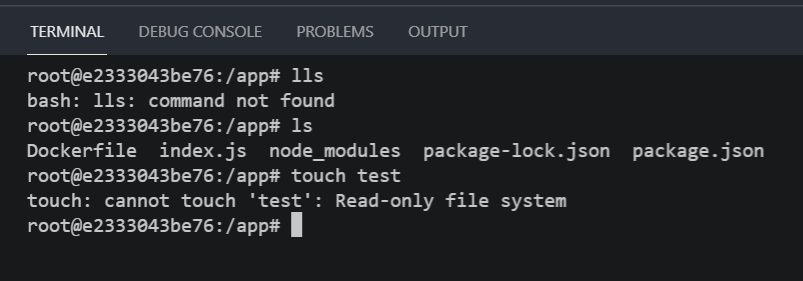


Environment variables
---
เดิม
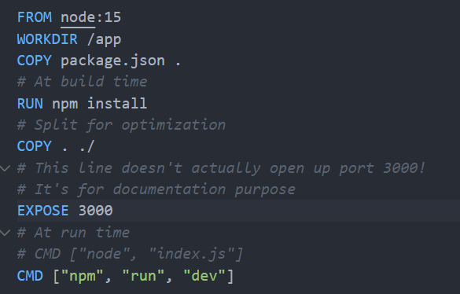

ตอนนี้
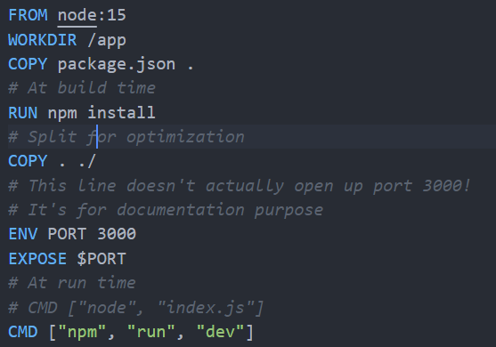

build ใหม่
``` docker build -t node-app-image .```

code ใน index.js แทบไม่ต้องเปลี่ยน เพราะมันเป็นหรือ ||
เราเปลี่ยน port เองได้ ```env PORT=4000``` จะทำให้ index.js มันรันที่ port 4000 แทน 
```
docker run -v ${pwd}:/app:ro -v /app/node_modules --env PORT=4000 -p 3000:4000 -d --name node-app node-app-image
```

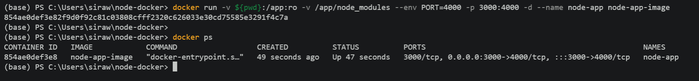

```printenv```

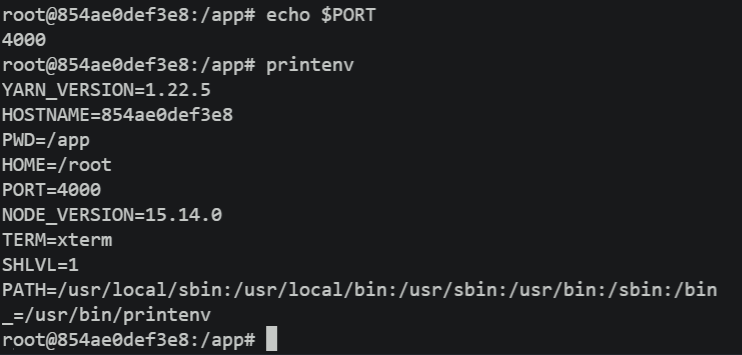


***
**Store เป็น File** 

ในกรณีที่มี env เยอะๆ แล้วไม่อยากเขียน -env ต่อกันยาว ๆ เพิ่มไฟล์ ```.env```

```
# Inside .env
PORT=4000
```

Command ```--env-file ./.env``` pass ตำแหน่งไฟล์ให้ด้วย
```
docker run -v ${pwd}:/app:ro -v /app/node_modules --env-file ./.env -p 3000:4000 -d --name node-app node-app-image
```
***
**ลบ Volume ที่ไม่ได้ใช้**

```docker volume ls```

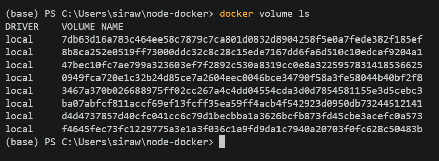

จะเห็นว่า volume เต็มไปหมด ซึ่งเกิดจาก ```-v /app/node_modules``` ที่เป็น anonymous volume
แม้เราจะลบ container ไปแล้ว แต่ volume ยัง persist อยู่

Workaround:

```docker volume rm [VOLUME NAME]```

หรือ

```docker volume prune```
(จะลบตัวที่ไม่ต้องการให้)

หรือ

```docker rm [CONTAINER NAME] -fv```

Docker-compose: When command is way too long...
---

### Docker compose 💕

ส่งทุกอย่างลงเป็น file แล้ว run ไม่ต้องนั่ง run command หลาย ๆ ที สำหรับแต่ละ container

[YouTube YAML](https://www.youtube.com/watch?v=o9pT9cWzbnI)

[Docker Compose version compatability matrix](https://docs.docker.com/compose/compose-file/compose-versioning/)

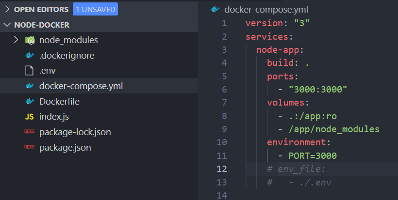

```yml
version: "3"
services:
  node-app:
    build: .
    ports:
      - "3000:3000"
    volumes:
      - .:/app:ro
      - /app/node_modules
    environment: 
      - PORT=3000
    # env_file:
    #   - ./.env

```

### to bring it up 

```docker-compose up```

เอาไว้ดู help

```docker-compose --help```

เติม detached mode ได้

```docker-compose up -d```

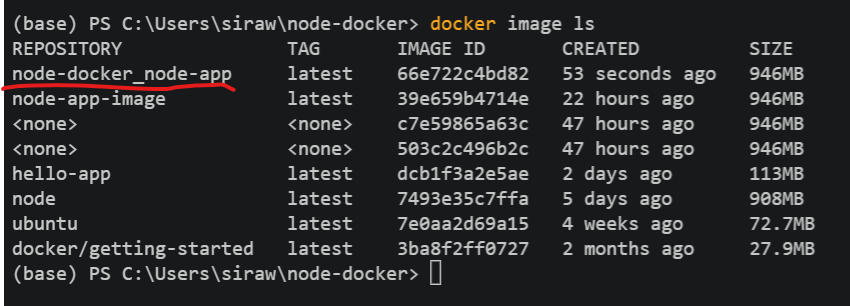

name convention = [PROJECT FOLDER_SERVICE NAME]

- It built our container
- It also started the container

### to bring it down

```docker-compose down```

```docker-compose down -v```

(also delete ano volume)

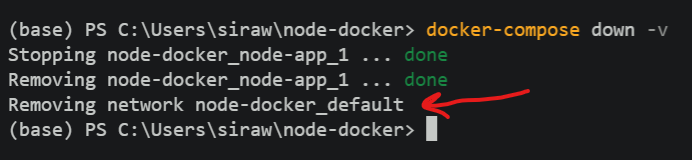


- ถึงแม้จะ ```docker-compose up -d``` ซ้ำ มันก็ไม่ทำอะไรไปมากกว่าเพิ่ม network
- เพราะ docker compose จะเช็คแค่ว่า มี image เดิมอยู่ไหม 
- ถึงแม้จะเปลี่ยน code อะไร เช่น เปลี่ยน port ใน Dockerfile  เวลา ```docker-compose up -d```  มันก็ไม่ได้จะ Rebuild image ให้เรานะ 🤔🤔

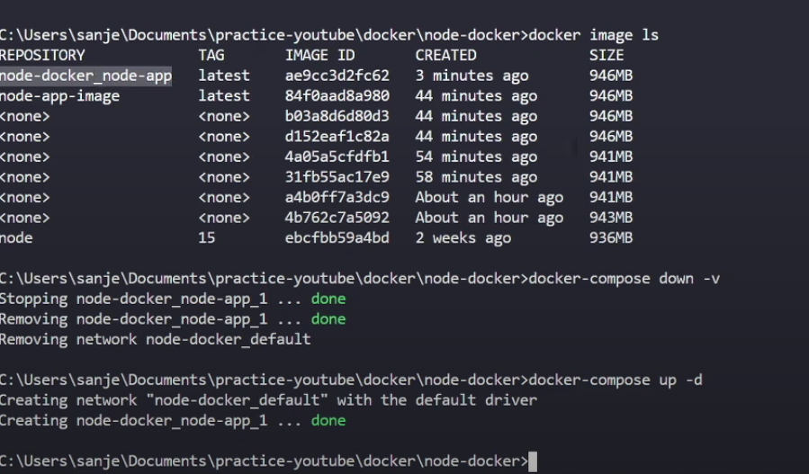

ต้องเพิ่ม ```--build เข้าไป```

👏 กลายเป็น ```docker-compose up -d --build``` จะได้ rebuild ให้ทุกครั้ง 


How to go into production ? (now we "npm run dev")
---
- ใน production ไม่ต้องการ bind mount
- จริง ๆ ต้องรัน ```npm start``` or ```node index.js``` แทน ```npm run dev```
<br>

### Deploy to both Dev and Production 😍

Workaround? 
- อาจจะทำ Dockerfile แยกกัน
- ทำ docker-compose แยกกัน

**ในที่นี้จะสอนแบบ Dockerfile เดียว แต่แยก docker-compose ออก**

docker-compose overwrite Dockerfile ได้

เช่น ```command: npm run dev```

***
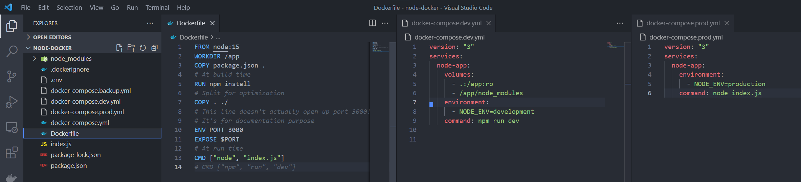

<br>

ตอนใช้ order สำคัญ ❗

```
docker-compose -f docker-compose.yml -f docker-compose.dev.yml up -d
```

```
docker-compose -f docker-compose.yml -f docker-compose.prod.yml up -d
```
>(ตอน production ไม่มี bind mount เพราะงั้นเปลี่ยนของใน index.js web ก็ไม่เปลี่ยนจ้า)
(ถ้าจะเอา dev ขึ้น production ก็ rebuild image ใหม่ แค่นั้น เติม ```--build```)

<br>

ตอน down เปลี่ยน up เป็น down 
```
docker-compose -f docker-compose.yml -f docker-compose.dev.yml down -d
```

~~แต่ใช้สั้น ๆก็คิดว่าน่าจะได้นะ ```docker-compose down -v```~~ ใช้ไม่ได้ว่ะ


* [x] **อย่าลืม .dockerignore**

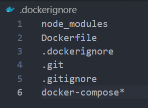


---

### ISSUE: Nodemon is installed! 😒

เปลืองที่ + ไม่จำเป็น

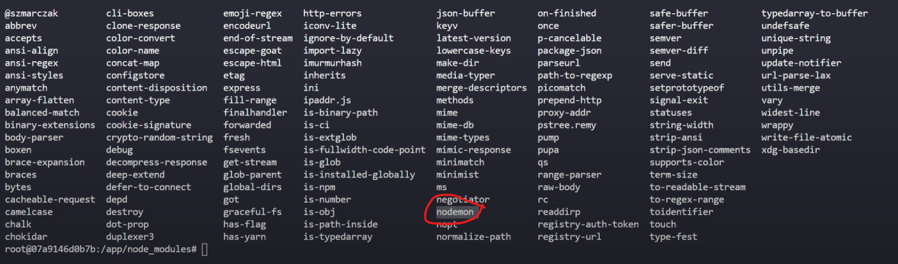


เพิ่ม ```--only=production``` ใน Dockerfile


ใน json ตอน npm เราใส่ flag --save-dev แล้ว อิอิ  ```npm install --save-dev```
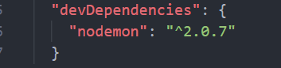


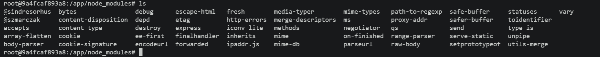


## ทำแบบนี้ตะหาก 5555

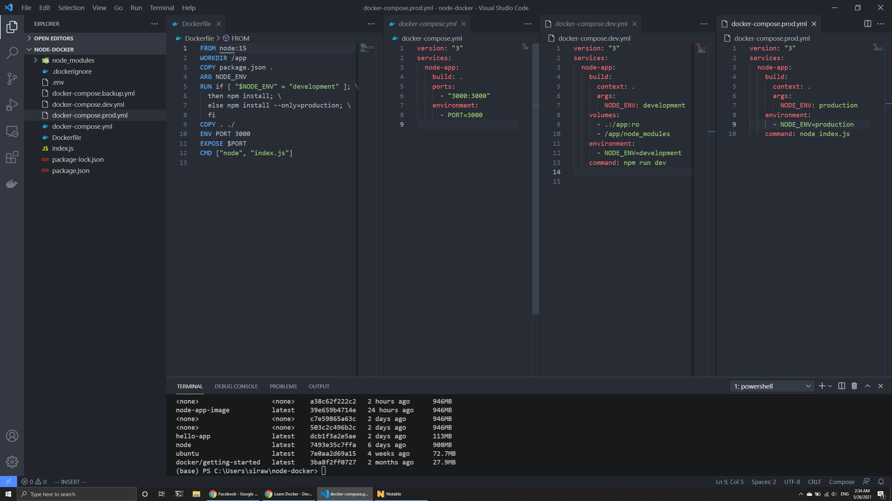

[1] Dockerfile
```Dockerfile
FROM node:15
WORKDIR /app
COPY package.json .
ARG NODE_ENV
RUN if [ "$NODE_ENV" = "development" ]; \
  then npm install; \
  else npm install --only=production; \
  fi
COPY . ./
ENV PORT 3000
EXPOSE $PORT
CMD ["node", "index.js"]
```

[2] docker-compose.yml
```yml
version: "3"
services:
  node-app:
    build: .
    ports:
      - "3000:3000"
    environment: 
      - PORT=3000
```

[3] docker-compose.dev.yml

```yml
version: "3"
services:
  node-app:
    build:
      context: .
      args:
        NODE_ENV: development
    volumes:
      - .:/app:ro
      - /app/node_modules
    environment: 
      - NODE_ENV=development
    command: npm run dev
```

[4] docker-compose.prod.yml

```yml
version: "3"
services:
  node-app:
    build:
      context: .
      args:
        NODE_ENV: production
    environment: 
      - NODE_ENV=production
    command: node index.js
```
